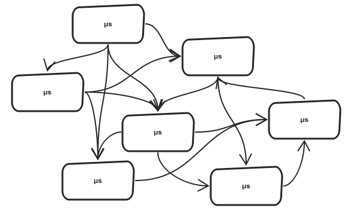

# @color[#0CC1C8](gRPC and Protocol Buffers)

---

@snap[west span-50]
## Speaker
<ul>
<li>John Regner</li>
<li>@color[#0084b4](@fab[twitter])@JohnDRegner</li>
</ul>

@snapend

@snap[east span-50]

@snapend

---

## What is gRPC?
<ul>
<li>g = Google</li>
<li>RPC = Remote Procedure Call</li>
</ul>

---

### ...No but seriously tell me what gRPC is

---

#### gRPC is an Open Source project based off of Google's Stubby framework
##### (Stubby being their RPC approach since 2001)
#### i.e. Not a protocol, but a proprietary (yet open) messaging framework

---

## Microservices!
##### Gotta love 'em.


---

### Microservice Challenges
<ul>
<li>Network Speed</li>
<li>Data Serialization</li>
<li>Security/Authentication</li>
<li>Language Interop</li>
<li>Monitoring</li>
<li>Debugging</li>
</ul>

---

## gRPC Approach

<ul>
<li>Performance</li>
<li>Strong typing with contract-first development</li>
<li>Deliberate generation of client/server elements</li>
<li>Streaming, esp. for real-time systems</li>
<li>Continued growth of support, including for latest .Net Core Previews</li>
</ul>

---

### Components of gRPC
<ul>
<li>Protocol Buffers</li>
<li>Service Stubs and Polyglot Support</li>
<li>HTTP/2</li>
</ul>

---

## Protocol Buffers

<ul>
<li>Interface Definition Language (IDL)</li>
<li>Data Model</li>
<li>Wire Format</li>
</ul>

---

### Proto Workflow

<ul>
<li>Create your IDL (.proto files)</li>
<li>Generate your language objects from it (protoc tool)</li>
<li>Drop them in your service implementation project (direct drop, package reference, etc.)</li>
</ul>

---

### Basic IDL Example
```protobuf
syntax = “proto3”;

message Person {
  string name = 1;
  int32 id = 2;
  string email = 3;
}
```

---

### More Complex Example
```protobuf
syntax = “proto3”;

import "PhoneType.proto";

message Person {
  string name = 1;
  int32 id = 2;
  string email = 3;

  message PhoneNumber {
    string number = 1;
    PhoneType type = 2;
  }
  repeated PhoneNumber phone = 4;
}
```

---

## Service Definition

<ul>
<li>Service method/signature definition</li>
<li>Code skeleton/stub generation</li>
</ul>

---


---

## Service IDL
```protobuf
service RouteGuide {
  rpc GetFeature(Point) returns (Feature);
  rpc RouteChat(stream Note) returns (stream Note);
}
message Point {
  int32 Latitude = 1;
  int32 Longitude = 2;
}
message Feature {
  string name = 1;
  Point location = 2;
}
message Note {
  Point location = 1;
  string message = 2;
}
```

---

@snap[north span-100]
### Protoc Process for gRPC Services
@snapend

@snap[west span-33]
<div class="text-center">
RouteGuide.proto<br>
@fa[file-alt fa-5x]
</div>
@snapend

@snap[midpoint span-33]
<div class="text-center">
@fa[long-arrow-alt-right fa-3x]
</div>
@snapend

@snap[east span-33]
<div class="text-center">
RouteGuide.cs<br>
RouteGuideGrpc.cs<br>
@fa[file-alt fa-5x] @fa[file-alt fa-5x]
</div>
@snapend

---

## Proto Over the Wire
```protobuf
message Person {
  string name = 1;
  int32 id = 2;
  string email = 3;
}
```

```protobuf
// name = "testing"...
// 12 07 74 65 73 74 69 6e 67
```
[//]: # "Field number as key"
[//]: # "Followed by value"
[//]: # "If length-delimited, length preceded value"

---

@snap[north span-66]
## Language Support!
@snapend

@snap[midpoint span-33]

@snapend

@snap[south-west span-33]

@snapend

@snap[south span-33]

@snapend

@snap[south-east span-33]

@snapend

---

## How does polyglot support work?
Same IDL files generate compatible stubs and skeletons in supported languages!

---


---

### Let's look at HTTP/2 Support
Published as RFC 7540 in May 2015.
<ul>
<li>Multiplexing</li>
<li>Bidirectional Streaming</li>
<li>HTTPS*</li>
</ul>

+++

### HTTP/2 multiplexing example
https://http2.golang.org/gophertiles

[//]: # "todo: more http/2 or streaming stuff?"

---

## Drawbacks

<ul>
<li>Higher learning curve than REST</li>
<li>Less client discovery than REST or GraphQL</li>
<li>Obfuscated payload</li>
</ul>

---

## Why should I try gRPC?

<ul>
<li>Performance</li>
<li>Strong typing with contract-first development</li>
<li>Deliberate generation of client/server elements</li>
<li>@css[text-bold](Internal APIs)</li>
</ul>

---

## I want to try gRPC but can't give up JSON/REST!

<ul>
<li>Ease Into Proto With JSON - shttps://developers.google.com/protocol-buffers/docs/proto3#json</li>
<li>Ease Into gRPC With REST - https://github.com/grpc-ecosystem/grpc-gateway</li>
</ul>

---
## Resources
<ul>
<li>https://github.com/grpc/grpc/tree/master/examples</li>
<li>https://grpc.io/docs/quickstart/csharp/</li>
<li>https://docs.microsoft.com/en-us/aspnet/core/grpc/aspnetcore</li>
</ul>

+++

## Appendix
#### Case Studies and Further Reading
<ul>
<li>https://www.cncf.io/netflix-case-study/</li>
<li>https://blogs.dropbox.com/tech/2019/01/courier-dropbox-migration-to-grpc/</li>
<li>https://medium.com/apis-and-digital-transformation/openapi-and-grpc-side-by-side-b6afb08f75ed</li>
<li>Several Blog articles from https://grpc.io/</li>
</ul>

+++

## Appendix
### Cloud Native Computing Foundation
Open Source Software Foundation for cloud native projects and tools<br />
https://www.cncf.io/ 

---
## @color[#0CC1C8](Thank You!)
<br />

@snap[south span-50]
@color[#0084b4](@fab[twitter]) @JohnDRegner
@snapend
