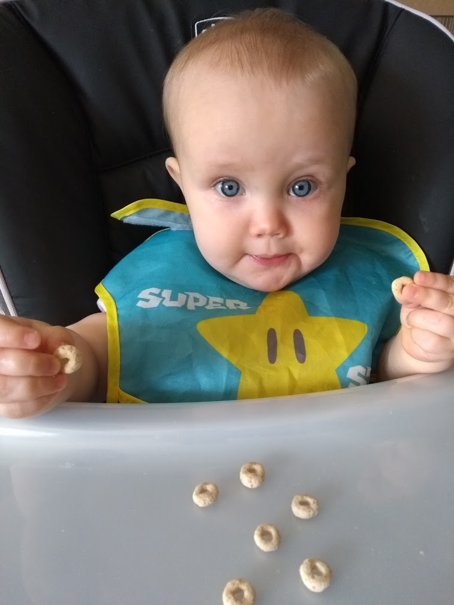
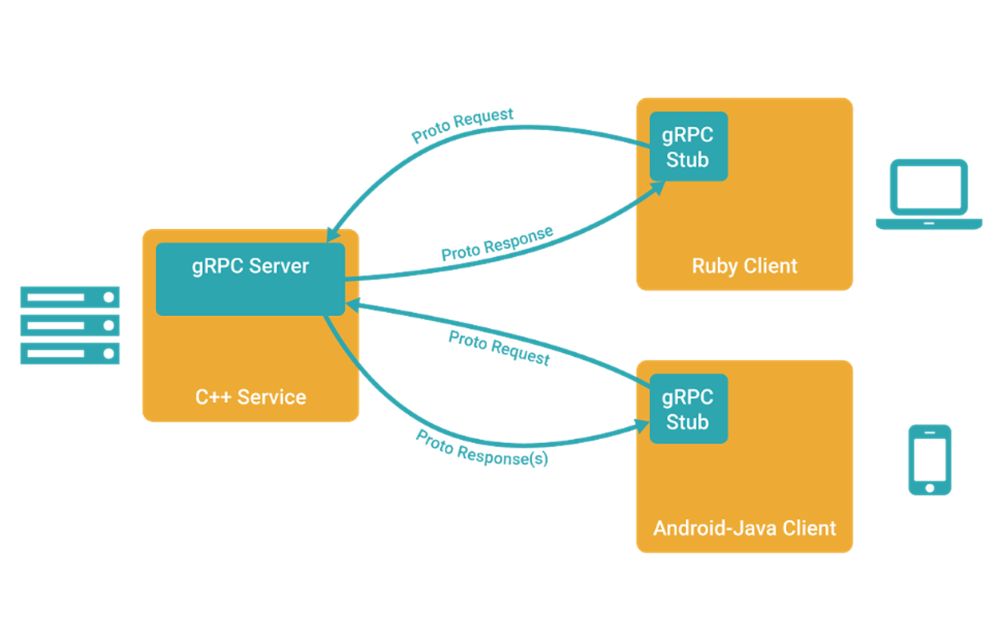
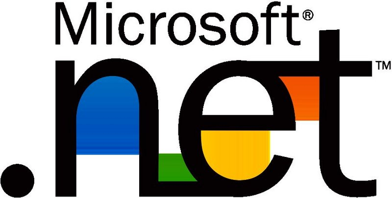

# @color[#0CC1C8](gRPC)

---

@snap[west span-50]
## Speaker
<ul>
  <li>John Regner</li>
  <li>@color[#0084b4](@fab[twitter])@JohnDRegner</li>
  <li>@color[#0077b5](@fab[linkedin])/johnregner</li>
</ul>

@snapend

@snap[east span-50]

@snapend

---

## What is gRPC?

#### gRPC (as in "Google Remote Procedure Calls") is an Open Source project based off of Google's Stubby framework

---

## gRPC Benefits

<ul>
  <li>Performance</li>
  <li>Code generation</li>
  <li>Strict specification</li>
  <li>Streaming</li>
  <li>Continued growth of support (.NET Core)</li>
</ul>

---

## Service IDL Example
```protobuf
service RouteGuide {
  rpc GetFeature(Point) returns (Feature);
}
message Point {
  int32 Latitude = 1;
  int32 Longitude = 2;
}
message Feature {
  string name = 1;
  Point location = 2;
}
```

---

### Polyglot Support!


+++

@snap[north span-66]
## Language Support!
@snapend

@snap[midpoint span-33]

@snapend

@snap[south-west span-33]

@snapend

@snap[south span-33]

@snapend

@snap[south-east span-33]

@snapend

---

## gRPC Drawbacks

<ul>
  <li>Less client discovery than REST or GraphQL
    <ul>
      <li>Limited browser support</li>
      <li>Obfuscated payload</li>
    </ul>
  </li>
  <li>Higher learning curve than REST
    <ul>
      <li>Due to above points</li>
      <li>Prevalance/communtiy support</li>
    </ul>  
  </li>
  <li>Ongoing .Net Core work (e.g. Azure App Services)</li>
</ul>

+++

## Drawbacks Appendix
<ul>
  <li>Workaround with gRPC-Web, but lacks bi-directional streaming support - https://devblogs.microsoft.com/aspnet/grpc-web-for-net-now-available/</li>
  <li>Azure App Service HTTP/2 support request - https://feedback.azure.com/forums/169385-web-apps/suggestions/40585333-grpc-support-in-azure-app-service</li>
</ul>

---

## gRPC Use Cases

<ul>
  <li>@css[text-bold](@color[#0CC1C8](Internal APIs, IoT))
    <ul>
      <li>Performance at scale</li>
      <li>Limited discovery needed</li>
      <li>Low-power operation</li>
      <li>Shaped around functions (verbs) over resources (nouns)</li>
    </ul>
  </li>
</ul>

---
## Resources For Getting Started
<ul>
  <li>https://github.com/grpc/grpc/tree/master/examples</li>
  <li>https://docs.microsoft.com/en-us/aspnet/core/grpc/basics?view=aspnetcore-3.1</li>
  <li>https://grpc.io/docs/quickstart/csharp/</li>
</ul>

+++

## Appendix
#### Case Studies and Further Reading
<ul>
  <li>https://www.cncf.io/netflix-case-study/</li>
  <li>https://blogs.dropbox.com/tech/2019/01/courier-dropbox-migration-to-grpc/</li>
  <li>https://medium.com/apis-and-digital-transformation/openapi-and-grpc-side-by-side-b6afb08f75ed</li>
  <li>Several Blog articles from https://grpc.io/</li>
</ul>

---
## @color[#0CC1C8](Thank You!)

@snap[south span-50]
@color[#0084b4](@fab[twitter]) @JohnDRegner<br>
@color[#0077b5](@fab[linkedin])/johnregner
@snapend
